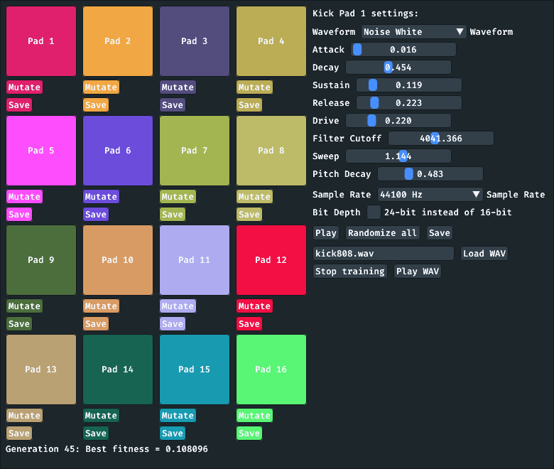

# Kickpad

Kick drum audio sample generator. Note that this entire program is a bit experimental.

## Features and limitations

* Can be used for sound design of kick drum sounds, for trying different waveforms and selecting different parameters.
* Can be used for loading an existing `.wav` audio sample and then evolve the settings so that they generate a kick drum sound that is as close as possible to the given `.wav`, using GA (genetic algorithms).
* Can be used for setting up 16 different kick drum sound, which can then be played by clicking the pad buttons.
* Uses `ffplay` for playing audio samples, for now, since I had issues combining SDL2 mixer package with the `giu` package. This may cause some clicks in the audio of more than one waveform is being played at once.

## What are all the buttons?

* There are 16 large buttons to the left, named "Pad 1" to "Pad 16".
* One of the 16 pads are always active, and the status text in the upper right will reflect this and say `Kick Pad 1 settings:` if `Pad 1` is active.
* The sliders and settings applies to the currently active pad.
* The "Mutate" button under every pad button will change the currently active settings, but just a bit.
* The "Save" button under every pad button will use the currently active settings to generate a kick drum sample and save that sample to a `kickN.wav` file. `N` is a number that will increase as the files are saved, `kick1.wav`, `kick2.wav` etc.
* The "Play" button on the right side will generate a kick drum sample for the currently active settings and then play it.
* The "Save" button on the right side will generate a kick drum sample for the currently active settings and then save it to a `kickN.wav` file.
* The "Randomize all" button on the right side will completely randomize all 16 pads.
* The "Load WAV" button on the right side will try to load the filename in the input text box right in front of it. This will also make two new buttons visible:
  * The "Find kick similar to WAV" button, which will start evolving the current settings until they are as similar as possible to the currently loaded WAV audio sample, using a genetic algorithm (GA).
  * The "Play WAV" button, which will play the currently loaded WAV audio sample.

## Requirements

* `ffplay`
* `glfw`
* `go` (1.23 or later)

## Installation

### Arch Linux

Kickpad is available in AUR and can be installed with ie. yay:

    yay -S kickpad

### macOS

Open a terminal:

* Press `Cmd + Space` to open Spotlight.
* Type in "terminal" and press `Return`.

Install Homebrew if you haven't already:

    /bin/bash -c "$(curl -fsSL https://raw.githubusercontent.com/Homebrew/install/HEAD/install.sh)"

Install the required dependencies:

    brew install ffmpeg go glfw

Install Kickpad:

    go install github.com/xyproto/kickpad@latest
    sudo install -m755 go/bin/kickpad /usr/local/bin/kickpad

Note that these instructions needs more testing. Please create an issue or PR if they need an improvement.

* Build with `go build -tags enable_cimgui_sdl2,exclude_cimgui_glfw,sdl2` to depend on SDL2.
* Build with `go build -tags enable_cimgui_glfw,exclude_cimgui_sdl` to depend on GLFW and the `ffplay` command.
* Building with `go -mod=mod` might be needed.

## Running

Open a terminal and type in:

    kickpad

## General info

* Version: 1.2.3
* Author: Alexander F. Rødseth &lt;xyproto@archlinux.org&gt;
* License: MIT
