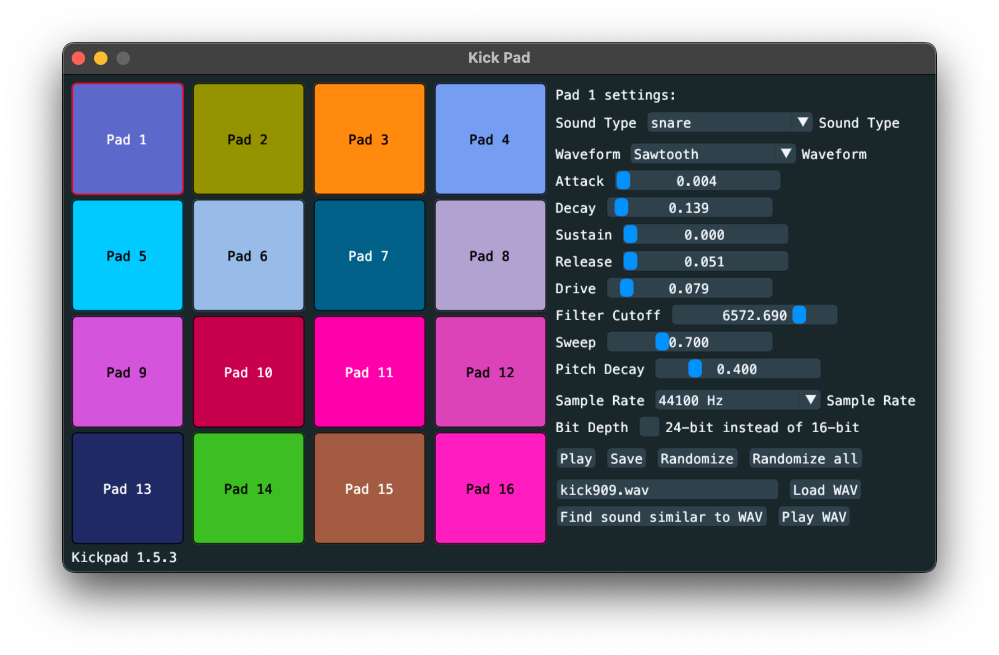

# Kickpad

Experimental kick drum audio sample generator.

## Features and limitations

* Can be used for sound design of kick drum sounds, for trying different waveforms and selecting different parameters.
* Can be used for loading an existing `.wav` audio sample and then evolve the settings so that they generate a kick drum sound that is as close as possible to the given `.wav`, using GA (genetic algorithms).
* Can be used for setting up 16 different kick drum sound, which can then be played by clicking the pad buttons.
* Tested on Arch Linux and macOS.

## Installation

* Install SDL2, SDL2_mix, GLFW and Go 1.23 or later.
* Then simply `go install github.com/xyproto/kickpad@latest` and the `kickpad` executable should be built and placed in `$GOBIN` (usually `~/go/bin`).

## What are all the buttons?

* There are 16 large buttons to the left, named "Pad 1" to "Pad 16".
* One of the 16 pads are always active, and the status text in the upper right will reflect this and say `Kick Pad 1 settings:` if `Pad 1` is active.
* The sliders and settings applies to the currently active pad.
* The "Mutate" button under every pad button will change the currently active settings, but just a bit.
* The "Save" button under every pad button will use the currently active settings to generate a kick drum sample and save that sample to a `kickN.wav` file. `N` is a number that will increase as the files are saved, `kick1.wav`, `kick2.wav` etc.
* The "Play" button on the right side will generate a kick drum sample for the currently active settings and then play it.
* The "Save" button on the right side will generate a kick drum sample for the currently active settings and then save it to a `kickN.wav` file.
* The "Randomize all" button on the right side will completely randomize all 16 pads.
* The "Load WAV" button on the right side will try to load the filename in the input text box right in front of it. This will also make two new buttons visible:
  * The "Find kick similar to WAV" button, which will start evolving the current settings until they are as similar as possible to the currently loaded WAV audio sample, using a genetic algorithm (GA).
  * The "Play WAV" button, which will play the currently loaded WAV audio sample.

## General info

* Version: 1.5.4
* Author: Alexander F. Rødseth
* License: MIT
